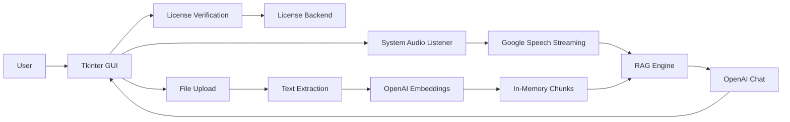

# PROJECT ANALYSIS

## Summary

ORBYNECUE is a Python desktop assistant for real-time meeting/interview support. It uses a Tkinter GUI, captures Windows system audio through VB-Audio Virtual Cable, streams audio to Google Cloud Speech-to-Text, indexes uploaded knowledge files with OpenAI embeddings, and answers questions using document-grounded retrieval with an OpenAI fallback.

## Technology Stack

- Runtime: Python 3.10+
- UI: Tkinter, Pillow
- Audio capture: PyAudioWPatch on Windows
- Speech-to-text: Google Cloud Speech streaming API
- LLM and embeddings: OpenAI Python SDK
- Document parsing: pypdf, python-docx, python-pptx, csv
- Packaging: PyInstaller
- Windows installer: Inno Setup
- Testing and quality: pytest, ruff, pip-audit

## Project Structure

- `main.py`: desktop application entry point.
- `gui.py`: Tkinter UI, license flow, file upload, listening controls, answer rendering.
- `listener.py`: Windows system-audio listener using VB-Audio Virtual Cable.
- `streaming_transcriber.py`: Google Cloud Speech streaming client.
- `file_processor.py`: knowledge-file extraction, chunking, OpenAI embedding creation.
- `rag_engine.py`: cosine-similarity retrieval and OpenAI answer generation.
- `license.py`: license cache, validation, and backend verification.
- `config.py`: shared environment, resource, credential, and config-path helpers.
- `Orbynecue.spec`: PyInstaller build specification.
- `orbynecue.iss`: Inno Setup installer definition.
- `tests/`: regression tests for import safety, config/license behavior, text processing, and RAG helpers.
- `.env.example`: required runtime environment variables template.

## Entry Points

- Source run: `python main.py`
- Package build: `pyinstaller --clean --noconfirm Orbynecue.spec`
- Windows installer build: compile `orbynecue.iss` with Inno Setup after PyInstaller completes on Windows.

## Services and Dependencies

- OpenAI API: requires `OPENAI_API_KEY`.
- Google Cloud Speech-to-Text: uses Application Default Credentials or `GOOGLE_APPLICATION_CREDENTIALS`.
- License backend: defaults to `https://cvolvepro.com/orbyneai/api/verify-license`, overridable with `ORBYNE_LICENSE_BACKEND_URL`.
- Local audio device: Windows machine with VB-Audio Virtual Cable configured.

## Architecture Overview

## Production Readiness

Current repository health score: 82/100.

The codebase now installs, lints, tests, audits, and packages under Python 3.10. Production readiness still depends on validating the Windows audio path, real Google credentials, real OpenAI credentials, and the live license backend in the target deployment environment.
